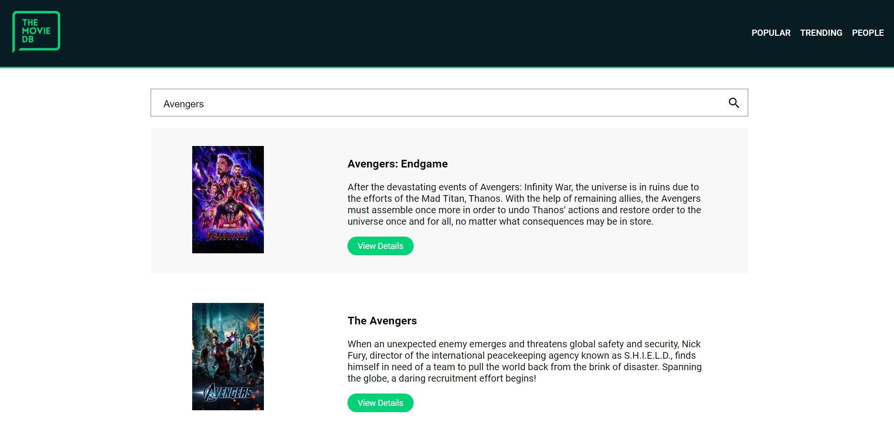
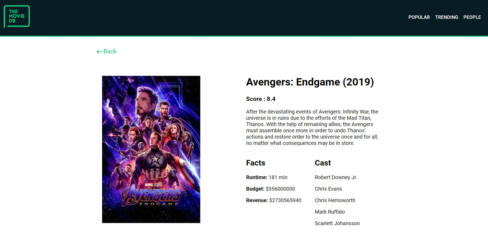

# [Movies and Chill](http://infamous-religion.surge.sh/)






> A front end app created using React  to allow visitors to browse movies and their cast based on data from [The Movie DB API](https://www.themoviedb.org/documentation/api)

---

### Table of Contents

- [Description](#description)
- [Installation](#installation)
- [License](#license)
- [Info](#info)

---

## Description

Develop a functional UI to support the following use cases: 

1. Browse trending and popular movies, and search all movies by title

2. View relevant details of a particular movie including but not limited to title, overview, release year, runtime and cast members

3. View details of specific actor or actress including but not limited to name, bio, birth date and list of movies in which have worked

4. Ensure proper navigation between screens

5. Feel free to use CSS frameworks like Bootstrap, Material UI or any other CSS framework

6. Feel free to use client-side state management libraries such as Flux or Redux

7. Add relevant code comments and modularise the code properly

8. Use git source control system and make nice commits with proper commit messages


Have a look at the Live version [here](http://infamous-religion.surge.sh/).

#### Technologies

- React

---

## Installation

#### `Step 1` - Clone the repo

```bash
$ git clone https://github.com/roheat/indorse-movies.git
```

#### `Step 2` - cd in the repo

```bash
$ cd indorse-movies
```

#### `Step 3` - Install dependencies

```bash
$ npm install
```

#### `Step 4` - Create `.env` file with your [MoviesDB API key](https://www.themoviedb.org/documentation/api)

```bash
REACT_APP_API_KEY = <<api key>>
```

#### `Step 5` - Run application

```bash
$ npm start
```

In browser, open [http://localhost:3000](http://localhost:3000)

---

## License

MIT © [roheat](https://github.com/roheat)

---

## Info

- Website - [roheat.com](https://roheat.com)
- Twitter - [@roheatdotcom](https://twitter.com/roheatdotcom)
- LinkedIn - [Rohith Srivathsav](https://www.linkedin.com/in/rohith-srivathsav/)
